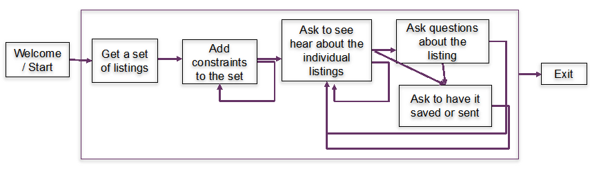

# PA5 - Working with the DialogFlow

Develop a chat dialog system that helps you find an house for sale in Waltham. Use the CSV file of real estate listings as the data. Use the diagram below as a guide to the functionality.  The bot should be integrated with Slack.

The bot should include the following blocks

## Requirements 
Include at least one example of

* A required slot
* Use of a context variable 
* Have at least one example of a reasonable error message where the intent/entities aren't recognized

For the box "Ask to have it saved or sent", it can be just "mocked up", that is have an appropriate reply but not be implemented (e.g. something like "Okay, sent to your e-mail"). For adding constraints, take a look at the fields in the CSV file and pick some of them. You don't need to implement all possible search criteria appeared in the data. I would suggest starting with categorical constrains such as location (city, neighborhood) then move on to more complex constraints defined as a range (price, size). 

## Implementation notes
* The webhook app needs to read in the house listing CSV file when it starts up. The data file is small enough to keep the whole contents in memory, so you don't need to worry about database implementation. 
* The read-in data should be accessible from all entry points, so make it a global variable.
* Webhook should have only one entry point (route), but should be able to handle different intents based on the contents of the request. 
* Remember the DF fulfillment sends requests as `POST`ing. 

## Deployment notes - if using Heroku for deployment
* Start from a "tabula-rasa" python using conda-env or virtualenv to generate concise `requirements.txt`.
* Don't forget `Procfile` to start up your main script. 
* Heroku sets `$PORT` variable to open some random port then expose it to the world. Make sure your `run()` method (or an equivalent in your language/framework) listens to `"0.0.0.0:$PATH"`. 

## Submission

##### DUE: 11/9/2018 

Submit via Github, commit following deliverables in directories specified below. 
You can work in a pair, but should deliver individually, even the material is identical to each other's. In case you've worked with someone else, let us know who you worked with in the write-up. 
* Export your DF agent as zip and extract the archive in `agent` directory
* A write-up `design.pdf` about overall design of the chatbot and decisions you made and policies you chose for the design of it. 
* Your webhook application in `app` directory
    * Include `app/README` file that explains how to run the app locally.
    * If you use Firebase Functions, say that in the readme. 
* Copy a sample dialog from slack into a text file `sample.txt`
    * This must not be a scripted mock-up, you need to copy and paste from an actual conversion with your bot. 

